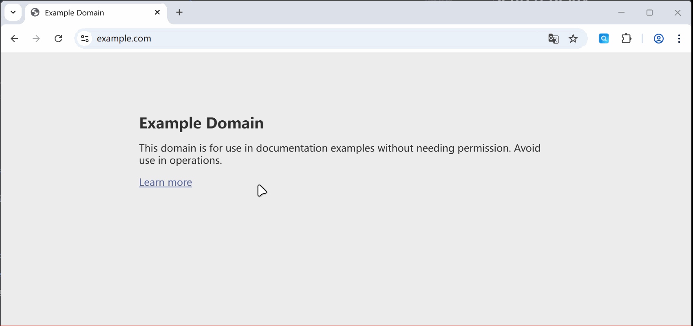
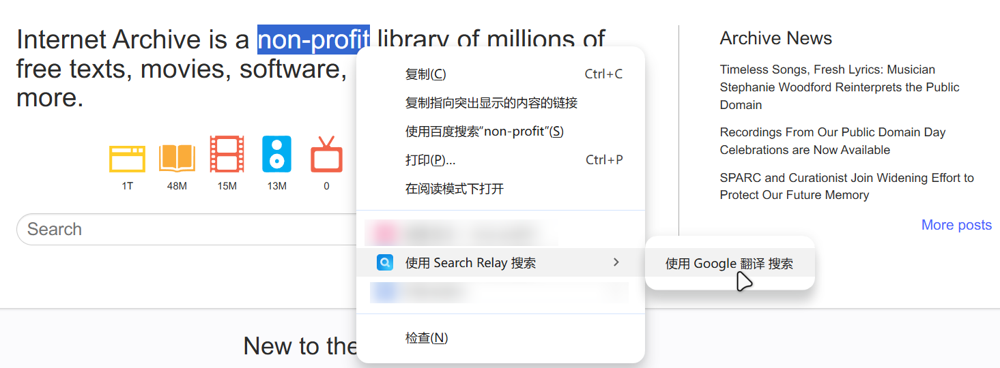

# Search Relay

一个简单的浏览器扩展，快速在不同搜索引擎之间跳转/比对搜索结果。支持划词搜索、右键菜单搜索，以及从当前搜索结果页一键提取关键词跳转到其他引擎

## 功能
### 一键切换搜索引擎
在某个搜索引擎中，若对搜索结果不满意，点击扩展图标，使用选定的搜索引擎一键重新搜索

Search Relay 会**自动提取搜索关键词**

> 也可以右键扩展图标，选择希望使用的搜索引擎

### 划词搜索
选中页面上的文字，通过右键菜单选项快速选择搜索引擎进行搜索

## 更多用法
### 自定义搜索引擎
在设置页中可以按照说明自行添加搜索引擎，比如可以添加哔哩哔哩为搜索引擎，快捷搜索b站视频

> [!TIP]
> 关于 **源引擎** 和 **目标引擎**
>
> **源引擎**：当你停留在这些网站的搜索结果页时，Search Relay 能读懂 URL，提取其中的关键词，准备传给下一个引擎
> 
> 举例：如果你把 `Bilibili` 设为**源引擎**，当你在B站搜索“教程”时，Search Relay 就能识别出关键词是“教程”
> 
> **目标引擎**：这是你点击 Search Relay 图标或使用右键菜单时，最终打开的新搜索引擎
> 
> 举例：如果你把 `Google` 设为**目标引擎**，在右键菜单中，就可以选择用 `Google` 来搜索关键词；也可以设为默认搜索引擎，在点击 Search Relay 图标时使用 `Google` 来搜索关键词

### 拓展：划词翻译
1. 勾选需要的翻译引擎，也可自行添加

2. 浏览网页时选中关键词

3. 右键选择翻译引擎

4. 插件将打开对应的翻译引擎页面，完成翻译

## 安装

### 商店下载
*   Edge Add-ons: [待发布]
*   Chrome Web Store: [计划中]

### 手动安装 (开发者模式)
1.  下载本项目源码或 Release 包，并解压
2.  打开浏览器扩展管理页：[Chrome](chrome://extensions/) /  [Edge](edge://extensions/)
3.  打开右上角的“开发者模式”
4.  点击“加载已解压的扩展程序”，选择解压目录

## 隐私声明
本扩展**不收集任何用户数据**。Search Relay 仅利用浏览器本地存储保存您的设置和搜索引擎数据，不会传输或收集任何私人浏览信息。

## 开源许可证
GNU General Public License v3.0

> 我们希望通过GPLv3许可证，确保 Search Relay 及其衍生作品始终保持开源，以更好地保护用户隐私。

Search Relay 的图标采用了 [icon8](https://icons8.com/icon/WwWusvLMTFd7/search) 的素材