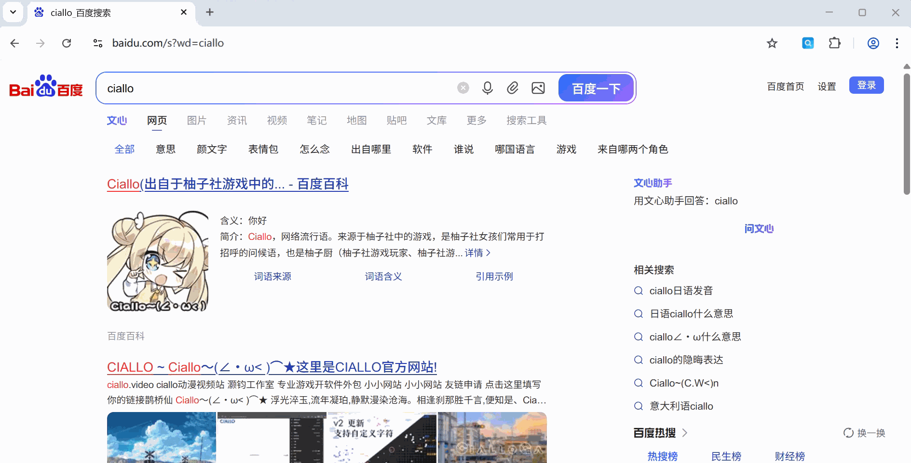
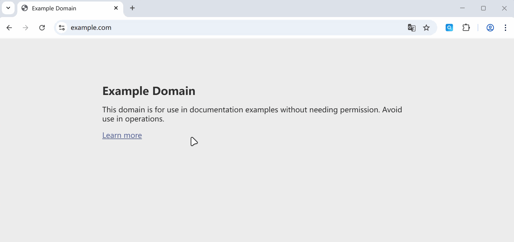

<h1 align="center">
   Search Relay
</h1>

  一个简单的浏览器扩展，快速在不同搜索引擎之间跳转/比对搜索结果 
  支持一键提取关键词切换搜索引擎、划词搜索、右键菜单搜索

 

  
  &nbsp;
  
  &nbsp;
  

## 功能 Features

### 一键切换搜索引擎

在某个搜索引擎中，若对搜索结果不满意，点击扩展图标，使用选定的搜索引擎一键重新搜索

Search Relay 会**自动提取当前搜索结果页的搜索关键词**

> 也可以右键扩展图标，选择希望使用的搜索引擎 
> 

### 划词搜索

选中页面上的文字，通过右键菜单选项快速选择搜索引擎进行搜索；也可划词后点击扩展图标搜索关键词

## 更多用法 More Usages

### 自定义搜索引擎

在设置页中可以按照说明自行添加搜索引擎，比如可以添加哔哩哔哩为搜索引擎，快捷搜索b站视频

> [!TIP]
> 关于 **源引擎** 和 **目标引擎**
>
> **源引擎**：当您停留在这些网站的搜索结果页时，Search Relay 能读懂 URL，提取其中的关键词，准备传给下一个引擎
>
> 举例：如果您把 `Bilibili` 设为**源引擎**，当您在B站搜索“教程”时，Search Relay 就能识别出关键词是“教程”
>
> **目标引擎**：这是您点击 Search Relay 图标或使用右键菜单时，最终打开的新搜索引擎
>
> 举例：如果您把 `Google` 设为**目标引擎**，在右键菜单中，就可以选择用 `Google` 来搜索关键词；目标引擎也可以被设为默认搜索引擎，在点击 Search Relay 图标时使用 `Google` 来搜索关键词

### 拓展：划词翻译

1. 勾选需要的翻译引擎，也可自行添加
   

2. 浏览网页时选中关键词

3. 右键选择翻译引擎
   

4. 插件将打开对应的翻译引擎页面，完成翻译
   

## 安装 Installation

### 商店下载

- Chrome Web Store: [点此获取](https://chromewebstore.google.com/detail/pdfcebejkdmomigfhbfejipoljdkbnhf/)
- Edge Add-ons: [点此获取](https://microsoftedge.microsoft.com/addons/detail/pnemkcglehklmoljjkkkejhplaignejo)
- Firefox Add-ons: [点此获取](https://addons.mozilla.org/firefox/addon/search-relay/)

### 手动安装 (开发者模式)

1.  下载本项目源码或 Release 包，并解压
2.  打开浏览器扩展管理页：`chrome://extensions/` 或 `edge://extensions/`
3.  打开右上角的“开发者模式”
4.  点击“加载已解压的扩展程序”，选择解压目录

## 构建&测试 Build & Test

参见：[构建&测试文档](docs/build&test.md)

## 隐私声明 Policy

本扩展**不收集任何用户数据**。Search Relay 仅利用浏览器本地存储保存您的设置和搜索引擎数据，不会传输或收集任何私人浏览信息。

## 开源许可证 License

GNU General Public License v3.0

> 我们希望通过GPLv3许可证，确保 Search Relay 及其衍生作品始终保持开源，以更好地保护用户隐私。

- 本项目使用了 [Icons8](https://icons8.com/icon/WwWusvLMTFd7/search) 提供的图标资源。
- `assets/design/Search-Relay.af` 及其设计稿版权归本项目作者 [@白隐Hakuin](https://github.com/Hakuin123) 所有。
- 本仓库中使用的商店徽章（Badges）及其设计稿的版权归其各自所有者所有。

另请参阅各大扩展商店的推广指南：

- [Chrome Web Store](https://developer.chrome.com/docs/webstore/branding/)
- [Microsoft Edge Add-ons](https://learn.microsoft.com/en-us/microsoft-edge/extensions-chromium/publish/badges)
- [FireFox Add-ons](https://extensionworkshop.com/documentation/publish/promoting-your-extension/)

---

开发者中心:
[Chrome](https://chrome.google.com/webstore/devconsole) | [Edge](https://partner.microsoft.com/zh-cn/dashboard/microsoftedge/overview) | [FireFox](https://addons.mozilla.org/zh-CN/developers/addons)
